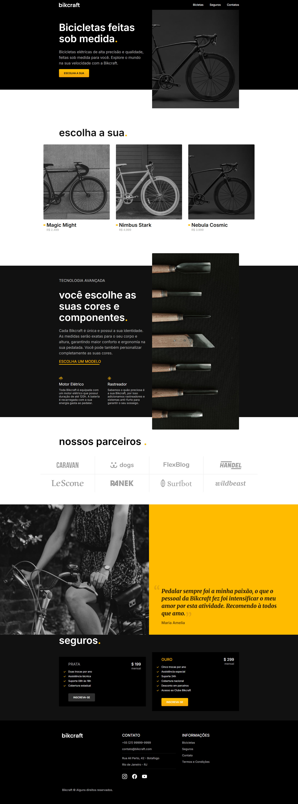
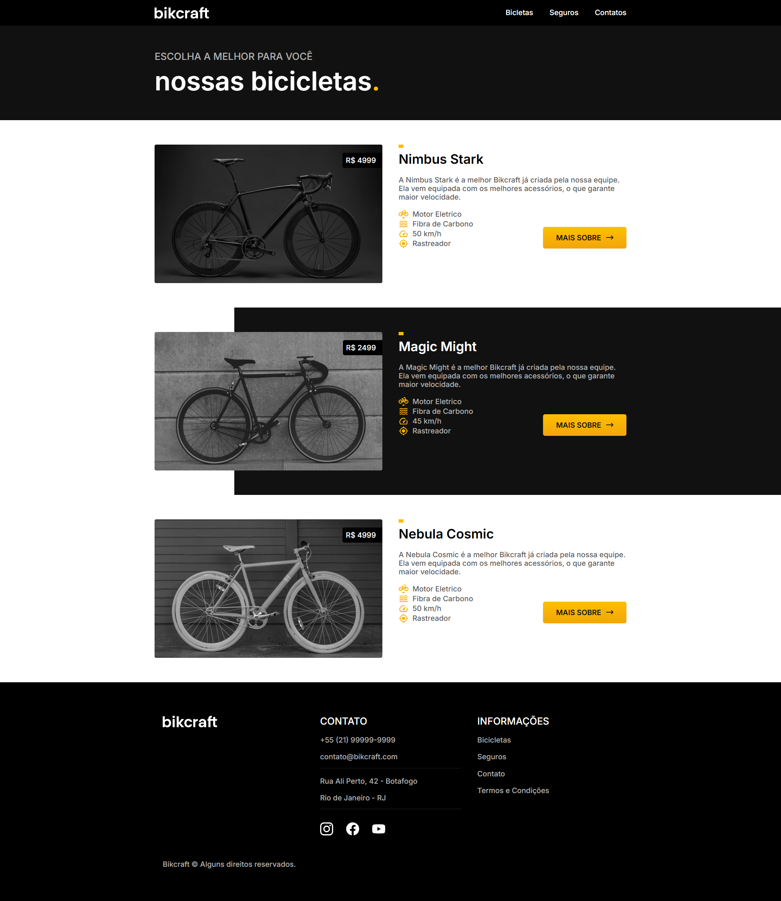
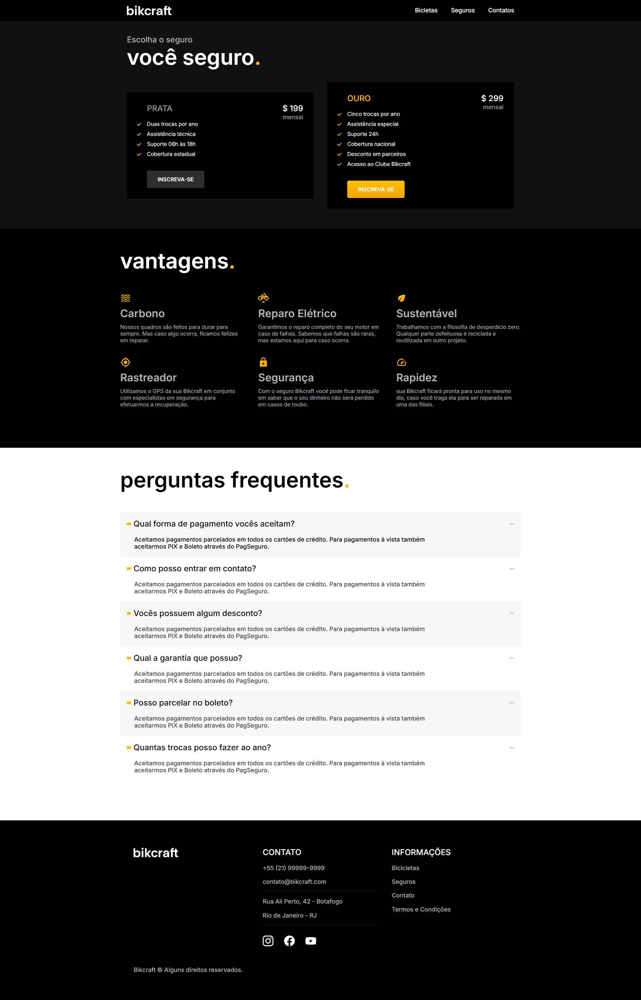

<p align="center"></p>

<h2 align="center">🚴‍♂️ Bikcraft Completo</h2>

**Bikcraft Completo** é uma evolução do projeto original **Bikcraft**, trazendo mais tecnologias, funcionalidades e uma experiência aprimorada. Desenvolvido com base no curso de front-end da Origamid, esta versão expandida apresenta uma aplicação mais robusta e moderna para venda de bicicletas personalizadas.

<table>
  <tr>
    <td>
      
    </td>
    <td style="vertical-align: top; padding-left: 10px;">
      
      
    </td>
  </tr>
</table>


## 📋 Descrição do Projeto

Este projeto é uma versão aprimorada do site Bikcraft, focado em oferecer uma interface mais completa, com uso avançado de tecnologias de front-end. O objetivo é praticar e consolidar conhecimentos em desenvolvimento web, aplicando novas funcionalidades e melhorias no layout e na usabilidade.

## 🔧 Tecnologias Utilizadas

* **HTML5** — Estrutura semântica do site
* **CSS3** — Estilização e layout responsivo
* **Git e GitHub** — Controle de versão e hospedagem do código

## 🚀 Funcionalidades

* Layout responsivo para dispositivos móveis e desktops
* Seções detalhadas com produtos e informações
* Animações e efeitos visuais aprimorados
* Otimização para melhor experiência do usuário

## 📂 Estrutura de Pastas

```bash
bikcraft-completo/
│
├── assets/
│   ├── css/
│   │   ├── bicicleta/       # Estilos específicos da página bicicletas
│   │   ├── global/          # Estilos globais usados em todo o site
│   │   ├── home/            # Estilos da página inicial
│   │   ├── seguros/         # Estilos da página seguros
│   │   ├── termos/          # Estilos da página termos
│   │   ├── utilidades/      # Estilos utilitários e helpers
│   │   └── style.css        # Arquivo principal de estilos
│   │
│   ├── img/                 # Imagens e ícones
│   └── js/                  # Scripts JavaScript
│
├── bicicletas.html          # Página de bicicletas
├── contatos.html            # Página de contato
├── index.html               # Página principal
├── seguros.html             # Página de seguros
├── termos.html              # Página de termos
└── README.md                # Documentação do projeto

```

## 🖥️ Como Rodar o Projeto Localmente

1. Clone o repositório:

```bash
git clone https://github.com/sarahbeirigo/bikcraft-completo.git
```

2. Acesse o diretório:

```bash
cd bikcraft-completo
```

3. Abra o arquivo `index.html` no navegador para visualizar o site.

## ✍️ Aprendizados

Neste projeto, aprofundei conhecimentos em:

* Desenvolvimento de layouts modernos e responsivos com CSS, aplicando técnicas para adaptar o design a diferentes tamanhos de tela e dispositivos.
* Organização e modularização de código front-end, dividindo estilos em pastas específicas para facilitar a manutenção e escalabilidade.
* Práticas de versionamento com Git, para controle eficiente de mudanças no código e colaboração.

## 📝 Contato

Se quiser saber mais sobre o projeto ou entrar em contato:

<a href="mailto:sarahcbeirigo@gmail.com"></a> <a href="https://www.linkedin.com/in/sarah-beirigo/" target="_blank"></a>

##

<p align="center">👩🏼‍💻 code by <a href="https://github.com/sarahbeirigo">Sarah Beirigo</a></p>

---

Se desejar, posso ajudar também com uma descrição curta para o campo “About” do repositório. Gostaria disso?
